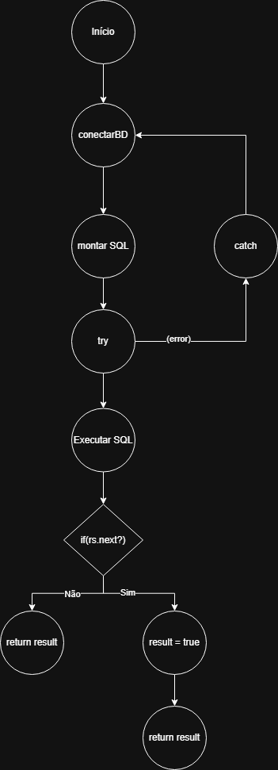

Este projeto apresenta uma análise de código com base em técnicas de teste de caixa branca aplicadas ao método `verificarUsuario()`, desenvolvido em Java. 

A atividade compreende:

- Análise estática do código-fonte
- Construção da notação de grafo de fluxo
- Cálculo da complexidade ciclomática
- Identificação de caminhos básicos
- Documentação de resultados

--

Análise Estática do Código:

Disponível na planilha abaixo
[`docs/planilha-analise-estatica.xlsx`](docs/planilha-analise-estatica.xlsx)

O grafo abaixo representa o fluxo lógico do método `verificarUsuario()`:

Este grafo foi usado como base para calcular a complexidade ciclomática e mapear os caminhos básicos.

A complexidade ciclomática foi calculada com base na seguinte fórmula: M = E − N + 2P

Onde temos:

E (arestas)= 7  
N (nós)= 6  
P (componentes conexos)= 1

Calculo: M = 7 − 6 + 2 × 1 = 3

A complexidade ciclomática é 3, indicando a existência de três caminhos lógicos independentes. 
Para garantir cobertura de testes total, são necessários no mínimo 3 casos de teste.

--

Caminhos Básicos

1. Caminho de sucesso:
   Usuário encontrado no banco de dados (`rs.next() == true`).

2. Caminho de falha lógica: 
   Usuário não encontrado (`rs.next() == false`).

3. Caminho de exceção:  
   Ocorre erro de execução (exceção capturada no bloco `catch`).
